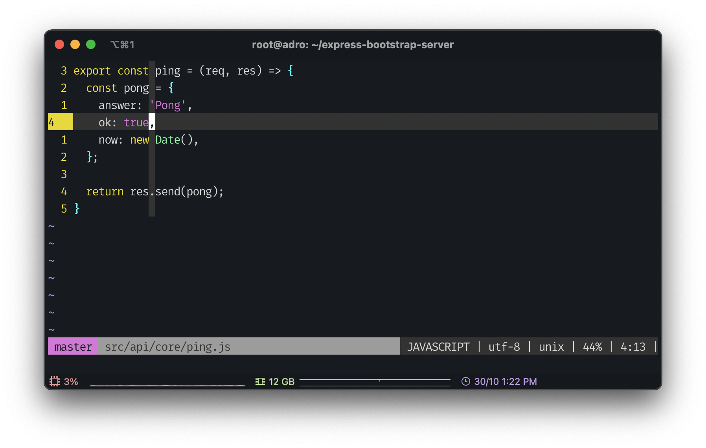

# YAVF

Yet another `vimrc` file. This is a high opinionated vim configurations file to use when no plugins can be used



## Usage

1. Clone this repo

    ```bash
    git clone https://github.com/adroaldof/vimrc.git
    ```

1. Create a symbolic link to the vimrc file

    ```bash
    ln -s <repo_path>/vimrc ~/.vimrc
    ```

1. Now just open your vim and start to happy type 

    ```bash
    vim <your_project_file>
    ```

## Some references

- [Learn Vimscript the Hard Way](https://learnvimscriptthehardway.stevelosh.com/)
- [Highlighting yanked text with pure vimscript](https://www.statox.fr/posts/2020/07/vim_flash_yanked_text/)
- [Vimrc Configuration Guide](https://www.freecodecamp.org/news/vimrc-configuration-guide-customize-your-vim-editor/)

---

Enjoy it :wink:
